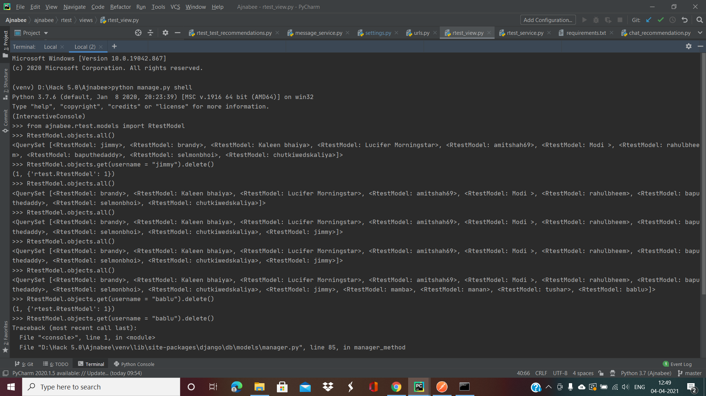
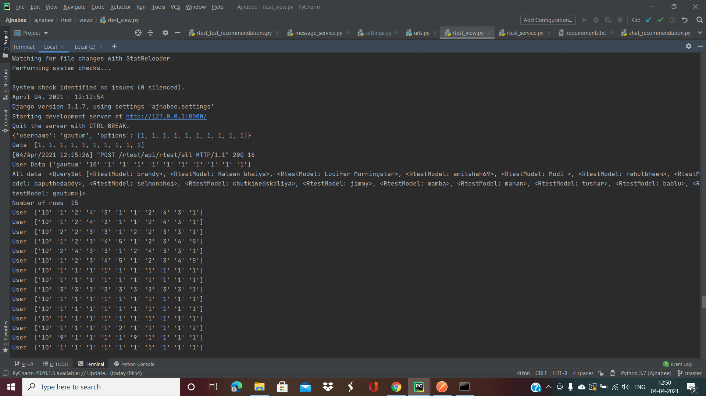
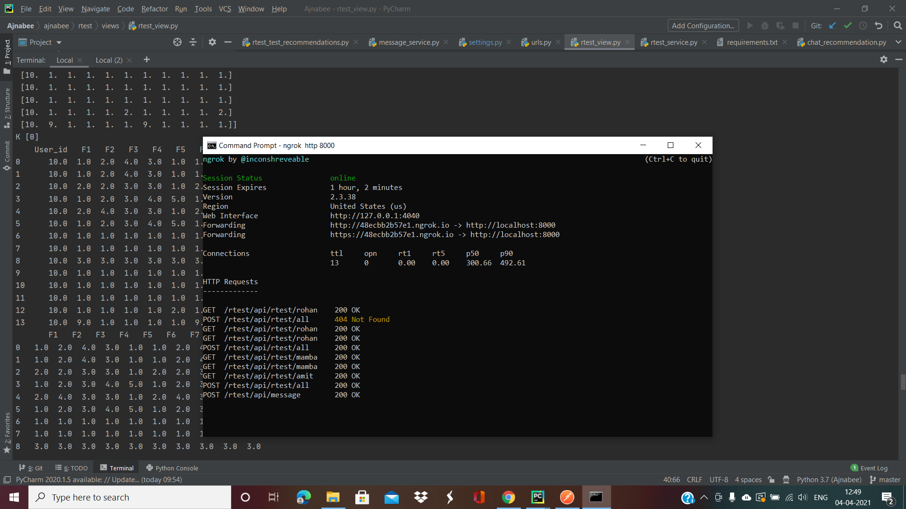

<h1 align="center">Ajnabee :hippopotamus:</h1>
<div align="center">
  <br>
  <h3> Meet people in a revolutionary way.</h3>
</div>

### This is the server for our mobile application Ajnabee 
#### The link to the repo of our mobile application <a href="https://github.com/Hungry-Hippoos/Ajnabee-mobile">link :link:</a>

---

-Snapshots of the project :


  
  


  
### To run this project :

Clone the project -
```
  $ git clone https://github.com/Hungry-Hippoos/Ajnabee.git
```
  
Go to the project -
```
  $ cd Ajnabee
 ``` 
Install all the reqirements -
```
  $ pip install -r requirements.txt
 ``` 
Run the following commands -

 for linux/mac :
``` 
  $ python manage.py migrate
  $ python manage.py makemigrations
``` 
 for windows :
 ``` 
  $ py manage.py migrate
  $ py manage.py makemigrations
 ``` 
Start the project -

 for linux/mac :
```
  $ python manage.py runserver
```  
 for windows :
``` 
  $ py manage.py runserver
```

---
#### This project was built under 24 hours

---
<h3 align="center"><b>Developed with :heart: by <a href="https://github.com/mrpandya">Manan Pandya</a>, <a href="https://github.com/tusharsarkar3">Tushar Sarkar</a>, <a href="https://github.com/dhairya903">Dhairya Shah</a>, <a href="https://github.com/sanjeetnaik">Sanjeet Naik</a>.</b></h1>
